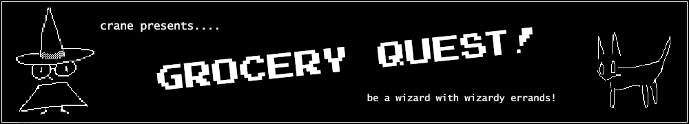

[](https://cryptidddd.itch.io/groceryquest)

# Grocery Quest


Grocery Quest is a non-linear text adventure I'm building from scratch. Its framework is something I would one day like to make available as a tool for other developers, but currently I don't think I'm ahead of anyone.

## Quickstart

> Notes from me to me.

To compile game with G++:
```
g++ -Iinclude src/driver.cpp src/game.cpp src/graph.cpp src/player.cpp src/story/groceryquest.cpp -o build/quest
```

To compile graph unit tests: 
```
g++ -Iinclude src/graph.cpp test/unitTests.cpp -o build/test/tests
```

To compile .res files:
```
windres src/meta/meta.rc -O coff -o bin/meta.res
windres src/meta/icon.rc -O coff -o bin/icon.res
```
