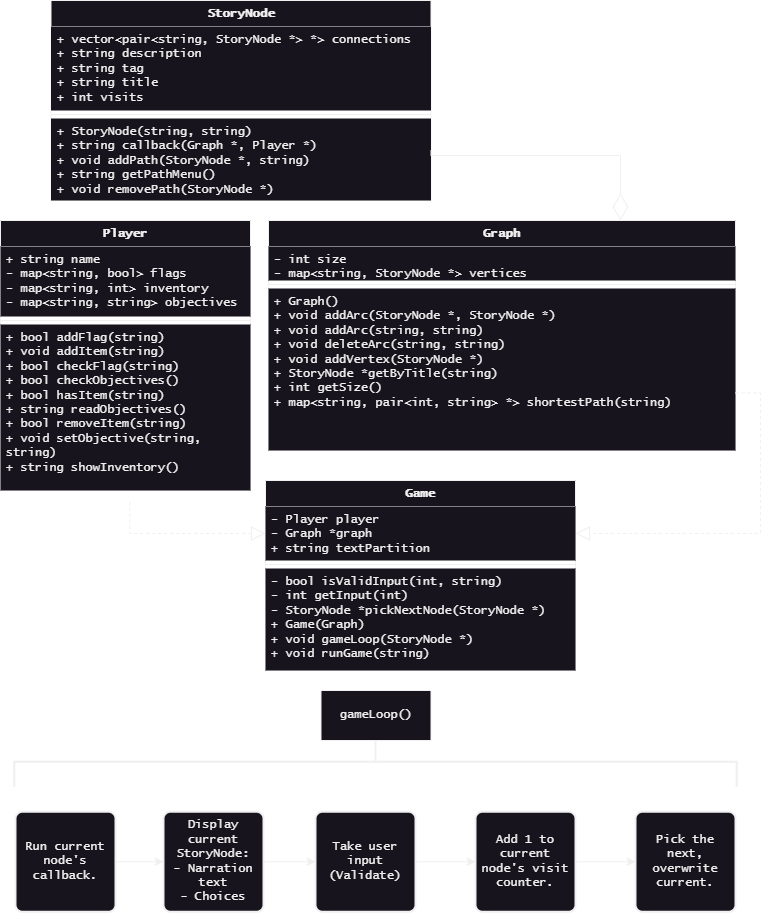

# Grocery Quest Design

Grocery Quest is the test game for its from-scratch framework.

## Design outline

## File skeleton:

- `graph.h` & `graph.cpp`
    + `Graph` class.
    + `StoryNode` struct.
    + `VertexTitleConflict` exception.
    + `VertexNotFound` exception.
- `player.h` & `player.cpp`
    + `Player` class.
- `story.h` & `story/groceryQuest.cpp`
    + `getStory()` function.
    - Files within `src/story/` implement `story.h`, providing the `getStory()` function with a real return value.
- `game.h` & `game.cpp`
    + `Game` class.
    + `EndProgram` exception.

## Improvements to be made

Between the tutorial and the actual story, the game holds onto unneeded data. In some cases, this could be cool (it adds a mysterious element if the game remembers how you behaved in the tutorial). However, after the tutorial, the actual nodes of the tutorial are no longer needed.

Additionally, text adventures can get really big. Is there a better way to load in nodes as appropriate? Between zones, for instance. This could be done with the use of tags. For example, when the player leaves for down (from hill.trail -> town.edge), they could instead be sent to a node tagged "load town.edge" or something of the sort. this prompts the game to load the town zone, and start them at the appropriate node.

It needs some work, but there's something there.

Plus an opportunity for a loading screen >:)

### Future summary

- Load by zone? 
- Delete subgraphs?
